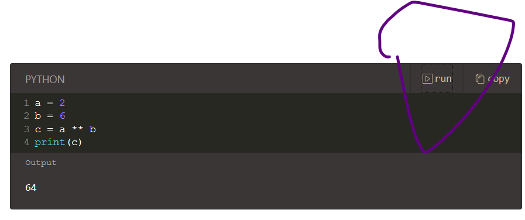

## 1.1 gitpress collection 使用说明

要创建集合（collection），请访问您的 [collection页面](https://gitpress.io/@me/collecions)，然后点击"New Collection"。接着按照如下步骤进行操作即可：

- 您需要准备 GitHub 存储库；
- 点击New Collection"，填写表单，然后点击"Create"；
- 要保持 collections 被同步，请完成设置并点击"Allow"。

假设您的文章的目录是 `/docs`，那么，请在该目录下创建 `TOC.md` 用于创建 collections 的布局。下面给出 GitPress Help 提供的一个案例：

```markdown
# Getting Started

- [1. Welcome to GitPress](welcome)
- [2. Your first article from GitHub repo](first-article)
- [3. Use GitPress collections](collection)
    - [3.1 Create a collection](create-a-collection)
    - [3.2 Use table of content](collection-toc)
- [4. FAQ](faq)
- [5. Troubleshooting](troubleshooting)

# User Manual

- [Front matter specification](front-matter)
- [Supported languages](languages)
- [Setup repo manually](setup-manually)
```

- 其中 `#` 开头的语句（如 `# User Manual`）将被识别为 collections 的章（类似于一本书的某一章）；而无序的列表格式将组织 collections 的节（类似于一本书的某一节）。
- 其中 `[Front matter specification](front-matter)` 这种格式，表示 `front-matter.md` 文件，`[]` 里面的内容为描述性语句。

> [!NOTE]
> 引入图片，必须将图片放置于 `images/` 或者 `assets/` 目录之内，否则图片无法显示。

## 1.2 GitPress 中的 Markdown

参考资料：<https://gitpress.io/c/helps/markdown>。

GitPress 支持 Markdown 的大多数功能，下面仅仅介绍一些特殊的用法。

### 1.2.1 Message Blocks

```markdown
> [!NOTE]
> This is a NOTE

> [!WARNING]
> This is a WARNING

> [!ERROR]
> This is a ERROR

> [!TIP]
> This is a TIP

> [!IMPORTANT]
> This is IMPORTANT
```

显示结果为：

> [!NOTE]
> This is a NOTE

> [!WARNING]
> This is a WARNING

> [!ERROR]
> This is a ERROR

> [!TIP]
> This is a TIP

> [!IMPORTANT]
> This is IMPORTANT

### 1.2.2 Reference Links

示例：

```markdown
This is [an example][id] reference-style link.

Then, anywhere in the document, you define your link label on a line by itself like this:

[id]: http://example.com/  "Optional Title Here"
```

即 GitPress 支持 id 索引。

### 1.2.3 支持 Code Runner

支持运行一些主流编程语言，比如：

```python
a = 2
b = 6
c = a ** b
print(c)
```

您可以直接点击 `run` 来运行代码：


